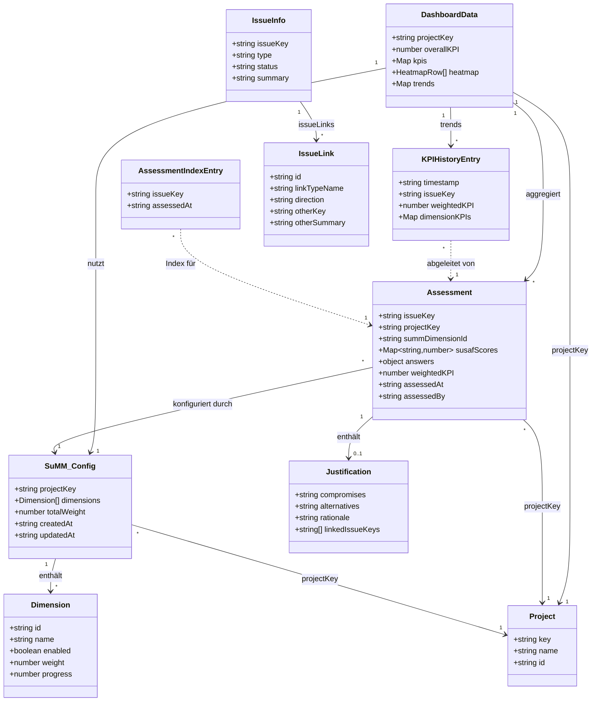

# Klassendiagramm – SustainScrum (aus dem Code abgeleitet)

Vollständiges UML-Klassendiagramm der im Code vorkommenden Datenstrukturen und ihrer Beziehungen.

---

## 1. Persistierte Entitäten (Forge Storage)

### SuMM_Config
*Storage-Key: `summ:{projectKey}`*

| Attribut      | Typ           | Beschreibung                    |
|---------------|---------------|---------------------------------|
| projectKey    | string        | Jira-Projektschlüssel           |
| dimensions    | Dimension[]   | Liste der Nachhaltigkeitsdimensionen |
| totalWeight   | number        | Gesamtgewicht (z. B. 9)         |
| createdAt     | string (ISO)  | Erstellzeitpunkt                |
| updatedAt     | string (ISO)  | Letzte Aktualisierung           |

---

### Dimension

| Attribut  | Typ     | Beschreibung                          |
|-----------|---------|----------------------------------------|
| id        | string  | z. B. environment, society, economy, individual, technical |
| name      | string  | Anzeigename                            |
| enabled   | boolean | In SuMM aktiviert                      |
| weight    | number  | Gewicht 0–9                            |
| progress  | number  | Fortschritt 0–100 (aus Bewertungen)    |

**Beziehung:** SuMM_Config enthält 1..* Dimension (Aggregation).

---

### Assessment
*Storage-Key: `assessment:{issueKey}`*

| Attribut       | Typ                    | Beschreibung |
|----------------|------------------------|--------------|
| issueKey       | string                 | Jira-Issue-Key |
| projectKey     | string                 | Projekt      |
| summDimensionId| string                 | Referenz auf erste/gewählte Dimension |
| susafScores    | Map\<string, number\>  | Dimension-ID → Bewertung 1–5 |
| answers        | object \| null         | Rohantworten pro Dimension/Frage (0 = Indifferent) |
| justification  | Justification \| null   | Optional: Begründung |
| weightedKPI    | number                 | Gewichteter KPI 0–100 |
| assessedAt     | string (ISO)           | Bewertungszeitpunkt |
| assessedBy     | string                 | Bewerter:in |

**Beziehung:** Assessment enthält 0..1 Justification (Komposition).

---

### Justification

| Attribut         | Typ      | Beschreibung |
|------------------|----------|--------------|
| compromises      | string   | Erfasste Kompromisse |
| alternatives     | string   | Erwogene Alternativen |
| rationale        | string   | Begründung |
| linkedIssueKeys  | string[] | Verknüpfte Issue-Keys (Rückverfolgbarkeit) |

**Beziehung:** Wird nur innerhalb von Assessment gespeichert (kein eigener Storage-Key).

---

### AssessmentIndexEntry
*Storage-Key: `assessments:{projectKey}` (Array von Einträgen)*

| Attribut   | Typ    | Beschreibung |
|------------|--------|--------------|
| issueKey   | string | Jira-Issue-Key |
| assessedAt | string (ISO) | Zeitpunkt der Bewertung |

**Beziehung:** Pro Projekt eine Liste; dient als Index, um alle Bewertungen eines Projekts zu laden.

---

### KPIHistoryEntry
*Storage-Key: `kpi-history:{projectKey}` (Array von Einträgen)*

| Attribut      | Typ                   | Beschreibung |
|---------------|-----------------------|--------------|
| timestamp     | string (ISO)          | Zeitpunkt    |
| issueKey      | string                | Zuordnung zur Story |
| weightedKPI   | number                | Gewichteter KPI |
| dimensionKPIs | Map\<string, number\> | KPI pro Dimension (0–100) |

**Beziehung:** Zeitreihe pro Projekt für Trend-Berechnung im Dashboard.

---

## 2. Von der Jira-API / Resolver zurückgegebene Strukturen

### Project
*Aus getProjects / Jira project/search*

| Attribut | Typ    | Beschreibung |
|----------|--------|--------------|
| key      | string | Projekt-Key  |
| name     | string | Projektname  |
| id       | string | Jira-ID      |

---

### IssueInfo
*Aus getIssueInfo (Jira Issue + Aufbereitung)*

| Attribut  | Typ          | Beschreibung |
|-----------|--------------|--------------|
| issueKey  | string       | Jira-Issue-Key |
| type      | string       | Issue-Typ (z. B. Story, Task, Nachhaltigkeitsgeschichte) |
| status    | string       | Status       |
| summary   | string       | Kurzbeschreibung |
| issueLinks| IssueLink[]  | Verknüpfte Issues (Traceability) |

---

### IssueLink

| Attribut      | Typ    | Beschreibung |
|---------------|--------|--------------|
| id            | string | Jira-Link-ID |
| linkTypeName  | string | z. B. Relates |
| direction     | string | outward \| inward |
| otherKey      | string | Key des verlinkten Issues |
| otherSummary  | string | Summary des verlinkten Issues |

---

### DashboardData
*Rückgabe von getDashboardData*

| Attribut          | Typ                              | Beschreibung |
|-------------------|----------------------------------|---------------|
| projectKey        | string                           | Projekt       |
| kpis              | Map\<string, KPIDimensionData\>  | KPI pro Dimension |
| overallKPI        | number                           | Gewichteter Gesamt-KPI |
| heatmap           | HeatmapRow[]                     | Issue × Dimension Scores |
| trends            | Map\<string, TrendPoint[]\>      | Pro Dimension: Zeitreihe |
| enabledDimensions| { id, name }[]                  | Aktivierte Dimensionen |

---

### KPIDimensionData

| Attribut       | Typ    | Beschreibung |
|----------------|--------|--------------|
| current        | number | Aktueller KPI-Wert |
| previous       | number | Vorheriger Wert (für Trend) |
| trend          | number | Absolute Änderung |
| trendDirection | string | "up" \| "down" |

---

### HeatmapRow

| Attribut | Typ                   | Beschreibung |
|----------|-----------------------|--------------|
| issueKey | string                | Jira-Issue-Key |
| scores   | Map\<string, number\> | Dimension-ID → Score 0–100 |

---

### TrendPoint

| Attribut  | Typ    | Beschreibung |
|-----------|--------|--------------|
| timestamp | string | Zeitpunkt    |
| value     | number | KPI-Wert     |

---

### SearchIssueResult
*Aus searchIssues (für Traceability / Justification)*

| Attribut | Typ    | Beschreibung |
|----------|--------|--------------|
| key      | string | Issue-Key    |
| summary  | string | Zusammenfassung |
| type     | string | Issue-Typ    |

---

### Sprint
*Aus getSprints (Jira Agile API oder Fallback)*

| Attribut | Typ    | Beschreibung |
|----------|--------|--------------|
| id       | string | Sprint-ID    |
| name     | string | Sprintname   |
| state    | string | active, closed, future |

---

## 3. Beziehungen (Übersicht)

| Von              | Zu               | Multiplizität | Art        | Beschreibung |
|------------------|------------------|---------------|------------|--------------|
| SuMM_Config      | Dimension        | 1 → *         | Aggregation| enthält      |
| Assessment       | Justification    | 1 → 0..1     | Komposition| enthält      |
| Assessment       | (Issue)          | * → 1         | Referenz   | issueKey referenziert Jira-Issue |
| SuMM_Config      | Assessment       | 1 → *         | Konfiguration | Gewichtung für KPI |
| AssessmentIndexEntry | Assessment   | * → 1         | Index      | verweist auf assessment:{issueKey} |
| KPIHistoryEntry | Assessment        | * → 1         | Ableitung  | pro Bewertung ein Eintrag |
| DashboardData    | SuMM_Config      | 1 → 1         | Nutzung    | nutzt Dimensionen/Gewichte |
| DashboardData    | Assessment       | 1 → *         | Aggregation| kpis, heatmap aus Assessments |
| DashboardData    | KPIHistoryEntry  | 1 → *         | Nutzung    | trends       |
| IssueInfo        | IssueLink        | 1 → *         | Aggregation| issueLinks   |

---

## 4. Mermaid-Code (zum Rendern z. B. auf mermaid.live)

**Herkunft:** Alle Klassen und Attribute stammen direkt aus dem Plugin-Code (`src/index.js`, Forge Storage Keys, Rückgaben der Resolver). Die Beziehungen entsprechen den Referenzen im Code (z. B. `summData.dimensions`, `assessment.justification`, `getDashboardData` lädt SuMM + Assessments + KPI-Historie).

**Warum nicht alle Klassen verbunden?** Einige Strukturen sind **nur Rückgabe-DTOs** (z. B. IssueInfo, Project) und werden nicht als Objekt in anderen gespeichert, sondern über IDs referenziert (issueKey, projectKey). Im Diagramm sind sie trotzdem eingezeichnet, weil sie im Code vorkommen; die Pfeile zeigen nur die **direkten Referenzen** („enthält“, „aggregiert“, „nutzt“).

---

*Abgeleitet aus dem SustainScrum-Plugin-Code (Backend Resolver, Forge Storage, Jira API).*
